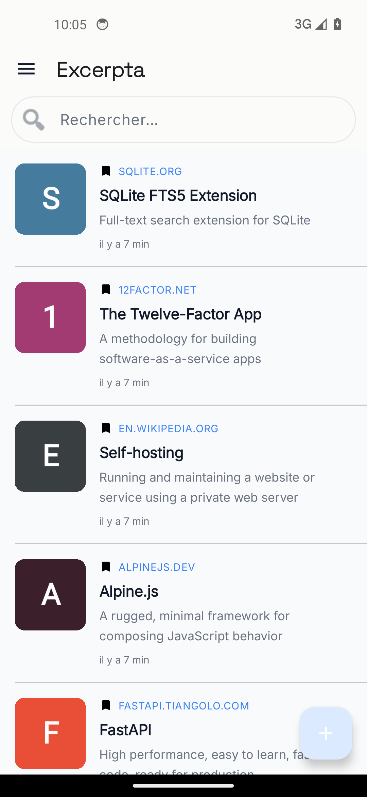
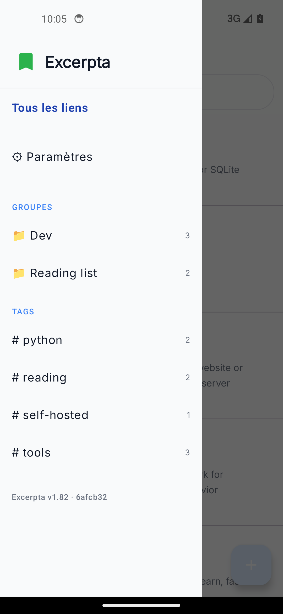

<p align="center">
  
</p>

# Excerpta Android

> **🤖 Vibe Coded with Claude**
> This project was built through an AI-assisted development session with [Claude](https://claude.ai) (Anthropic).
> It is shared as-is, without warranty of any kind. Test thoroughly before relying on it for anything critical.
>
> Remember: if you don't like projects coded with AI help don't use them ;-)

Android companion app for [Excerpta](https://github.com/notarobot63/excerpta), the self-hosted link manager.

> collect • annotate • remember

<p align="center">
  <a href="https://apps.obtainium.imranr.dev/redirect.html?r=obtainium://add/https://raw.githubusercontent.com/notarobot63/excerpta-android/main/obtainium.html"></a>
</p>

## Screenshots

<p align="center">
  
  
</p>

## Features

- **Paginated link list** with on-demand loading (swipe-to-refresh)
- **Navigation drawer**: hierarchical groups then tags
- **Quick add** via the FAB or the share button from Chrome/Firefox/etc.
- **Contextual actions** (long press): open, copy URL, make public/private, delete
- **Offline cache**: links stay accessible without network
- **QR code configuration**: scan the QR code from the web UI (Settings)
- **API key encrypted** locally (EncryptedSharedPreferences / AES-256)
- **Adaptive icon**, Material Design

## Download

**Obtainium (recommended)**: tap the badge above, or manually add this URL in Obtainium (automatic updates):

```
https://raw.githubusercontent.com/notarobot63/excerpta-android/main/obtainium.html
```

**Direct APK** (always the latest version):

```
https://github.com/notarobot63/excerpta-android/releases/latest/download/excerpta-android.apk
```

## Versioning

Releases follow [SemVer](https://semver.org) and are published by git tag:

```bash
git tag v1.2.0
git push origin v1.2.0
```

Only a `v*` tag creates a signed release; the Obtainium badge and the direct APK
link above always point to the latest one. A push to `main` still runs the CI
build, but the resulting APK is kept as a run artifact (14 days) instead of being
published.

`versionName` is the tag without its `v` (`1.2.0`), or `<count>-dev+<commit>` for
a build made outside a release. `versionCode` stays derived from the commit
count: it must increase monotonically, otherwise Android refuses to update
existing installations.

The server app follows its own release cycle: the contract between the two is
carried by the `/api/v1/` prefix, not by a shared version number.

## Configuration

1. Install the APK
2. Open the app → scan the QR code shown in **Excerpta → Settings**
3. The server URL and API key are configured automatically

## Building

```bash
git clone https://github.com/notarobot63/excerpta-android.git
cd excerpta-android

# Debug build (unsigned)
./gradlew assembleDebug
```

The resulting APK is at `app/build/outputs/apk/debug/app-debug.apk`.

## Stack

- Kotlin + Coroutines
- Material Design 3
- EncryptedSharedPreferences (security-crypto)
- ZXing (QR code scanning)

## License

[GNU Affero General Public License v3.0](LICENSE) - free to fork, strong copyleft, attribution required.
